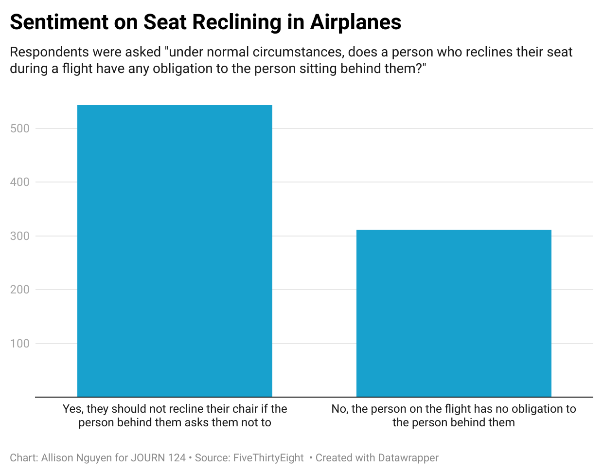

# journ124
Submission for JOURN 124 Quiz 4, Question 6

I picked this question as I felt sentiment was divided between my friend group and even my family. I would have answered yes, as I believe it is your responsibility to be polite to people in most situations. Some of my friends and family definitely would give the argument that you get what you pay for, and thus you do not have that responsibility, so I wanted to see which opinion was more  common and by how much. 

 	

This chart reveals that I am in the majority opinion on this issue and that most people feel that one does have the responsibilty for the person in front of them under normal circumstances. 
